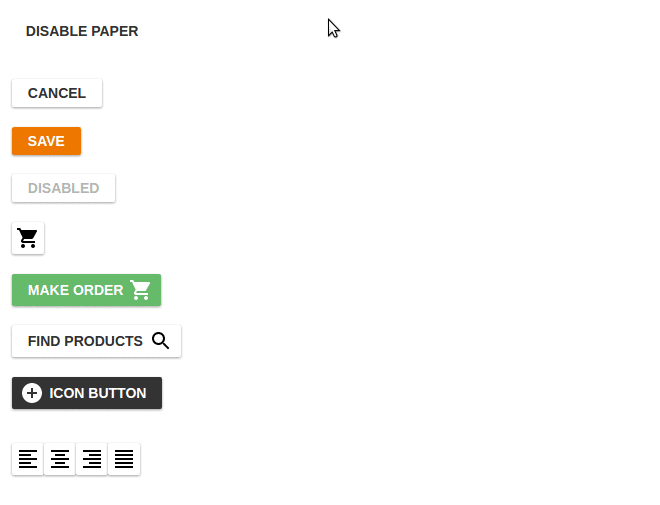

# react-buttons

## Synopsis

Simple Button react components. 

The **motivation** to develop - Twitter Bootstrap that we use don't provide any components for implementing accuracy looking toolbar buttons.

## Demo

[https://opuscapitabes.github.io/js-react-ui-buttons](https://opuscapitabes.github.io/js-react-ui-buttons)

## Installation

`yarn add @opuscapita/react-buttons`

`import { Button } from '@opuscapita/react-buttons`

or

`import Button from '@opuscapita/react-buttons/lib/Button`

## Contributors

[ Alexey Sergeev](https://github.com/asergeev-sc)

 

[ Kirill Volkovich](https://github.com/kvolkovich-sc)

## License

Licensed under the Apache License, Version 2.0. See [LICENSE](./LICENSE) for the full license text.
